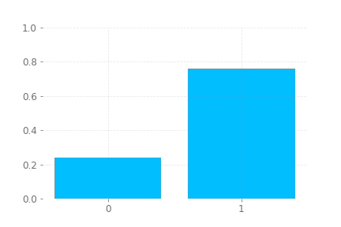
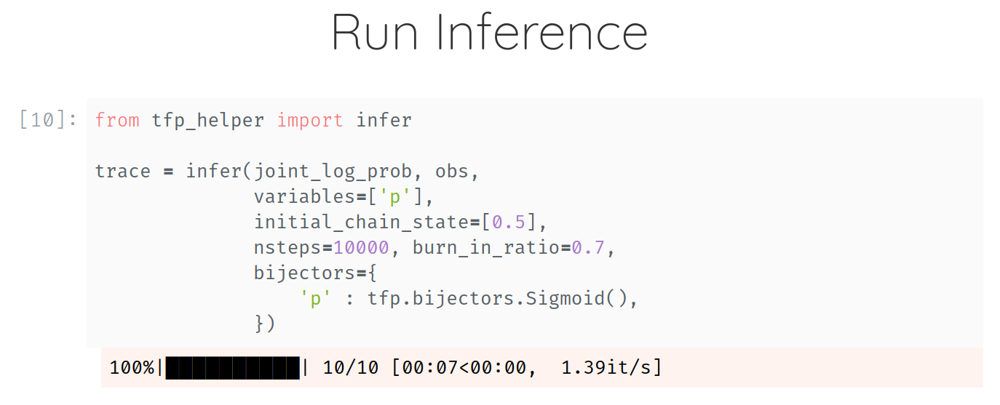
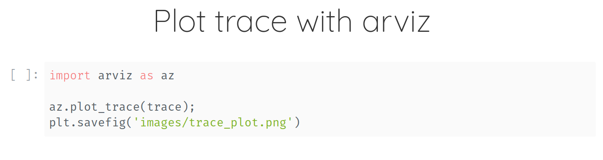
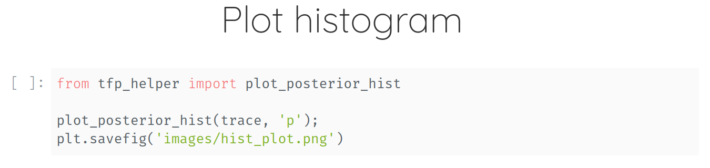

 

# tfp_helper

A tiny Helper Library for Tensorflow Probability. It helps you to quickly prototype probabilistic models and run automated inference without much hassle.

- **Inference Button** Single function call for running inference with MCMC
- **Plotting** Inference returns an instance of `arviz.InferenceData` which enables user to use `arviz` for plotting
- **Progress Bar** A smart tqdm-based progress bar to track the progress of MCMC ▓▓▓▓▓▓▓▓▓▓░░░░░

## Step 1: Get or Make Data




## Step 2: Joint Log-Probability


## Step 3: Inference



## Step 4: Plotting




## Step 5: More Plotting




## Getting Started

Instructions on getting the repo setup and running on your local machine.

### Prerequisites

Install requirements for using the library.

```bash
pip install -r requirements.txt
```

### Installation

Install library locally using `setup.py`.

```
python setup.py install
```


## Running the tests

Instructions for running tests.

```bash
pytest tests.py
```

## License

This project is licensed under the GNU GPL v3.0 License - see the [LICENSE](LICENSE) file for details.

